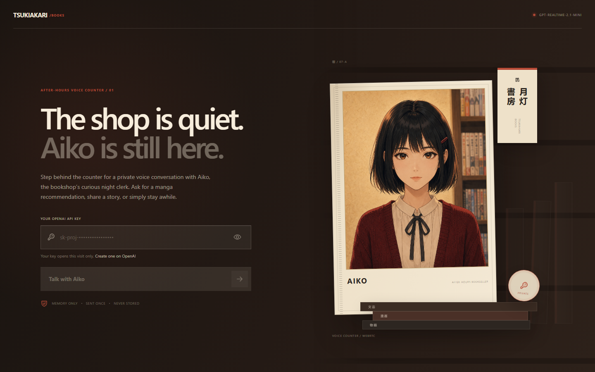

<div align="center">

# 🗣️ Talking Avatar

**An agent skill that turns a photo or a character description into a realtime voice-chat app — with a talking portrait whose mouth actually follows the spoken audio.**

Bring your own OpenAI key, speak, and watch one fixed character portrait lip-sync to the live reply. No full-face animation, no uncanny loops — just a mouth patch that moves with real sound.

```bash
npx skills add buildfastwithai/talking-avatar
```

</div>

---

## Proof

A real app built with this skill — [Tsukiakari Books](https://sotto-realtime-voice.satvikps.chatgpt.site/), a night-clerk character named Aiko:

<p align="center">
  
</p>


One canonical portrait, a BYOK key field that never persists the key, and a "Talk with Aiko" entry point into the realtime voice session — all generated and wired up by this skill.

## Why this exists

Most "AI avatar" demos either play a canned mouth-flapping loop that ignores the audio, or burn compute animating the entire face into the uncanny valley. Both look fake.

Talking Avatar takes a sharper, cheaper path: it generates **one canonical portrait** plus **three tiny mouth sprites** (soft, round, open), then drives them from the *actual remote audio stream* — sampling every animation frame, stepping through adjacent mouth poses, and closing on silence. The face pixels never move. The result is a character that feels like it's genuinely talking, running on a lightweight Next.js app you fully own.

## What you get

- 🎭 **Two input paths** — supply a **photo** (identity preserved: face shape, skin tone, hair, glasses, facial hair) or a **text description** (normalized into a concrete visual spec).
- 👄 **Audio-driven lip sync** — analyzes the real output `MediaStream` (not mic input, not event cadence), updates the mouth no faster than ~96 ms, smooths attack/decay, and steps `closed → soft → round → open`.
- 🔒 **BYOK security done right** — the OpenAI key lives in component memory only, crosses one same-origin HTTPS session route, and is cleared after negotiation. No localStorage, no logs, no long-lived key on the WebRTC peer.
- 🧱 **A proven starter** — battle-tested Next.js app templates + a scaffold script, so you get a runnable core instead of a blank page.
- ✅ **Real validation** — a regression test and an asset validator that reject drifted eyes, moved heads, or mismatched mouth-sprite dimensions.

## Use it

**Zero-friction (recommended)** — install once, then just ask:

```bash
npx skills add buildfastwithai/talking-avatar
```

Then, in your AI assistant:

> Use talking-avatar to turn my photo (or character description) into a realtime talking-avatar chatbot.

**Manual install**

- **Claude Code** — drop this folder into `~/.claude/skills/talking-avatar/` (keep `references/`, `scripts/`, and `assets/starter/`).
- **claude.ai** — upload the skill under **Settings → Capabilities → Skills**.
- **Any other assistant** — paste `SKILL.md` into your system prompt / rules, and keep the `references/` files available for the model to read.

## How it works (the recipe)

1. **Choose the input path** — inspect a supplied photo as an identity reference, or normalize a description into a visual spec; establish character name, persona, app name, language, and voice.
2. **Build the asset set** — one canonical closed-mouth portrait, then three identity-preserving mouth edits cropped to an identical rectangle. Saved as `public/avatar/avatar-base.jpg` + `mouth-soft/round/open.png`, then verified with `scripts/validate_avatar_assets.py`. *(See [`references/image-pipeline.md`](references/image-pipeline.md).)*
3. **Build or integrate the app** — scaffold a Next.js core with `scripts/scaffold_app.py`, or adapt individual files from `assets/starter/` into an existing product. *(See [`references/app-contract.md`](references/app-contract.md).)*
4. **Implement natural lip sync** — `AnalyserNode` + `requestAnimationFrame`, a 90–110 ms pose interval, adjacent-pose stepping, a `data-mouth` DOM attribute, and CSS revealing exactly one patch. *(See [`references/realtime-lipsync.md`](references/realtime-lipsync.md).)*
5. **Validate before handoff** — production build, lint, regression test, and confirmation that only the mouth changes during speech.

## What's in the box

```
talking-avatar/
├── SKILL.md                          # the method — install this
├── agents/openai.yaml                # display name + default prompt
├── references/
│   ├── image-pipeline.md             # canonical portrait + mouth-sprite generation
│   ├── app-contract.md               # Realtime route + BYOK key flow
│   └── realtime-lipsync.md           # the audio-driven lip-sync contract
├── scripts/
│   ├── scaffold_app.py               # generate the Next.js core
│   └── validate_avatar_assets.py     # reject bad/misaligned mouth sprites
└── assets/starter/                   # proven Next.js app templates
    ├── app/ (TalkingAvatarApp, layout, page, realtime route, globals)
    └── tests/talking-avatar.test.mjs
```

## What it refuses to do

- Canned infinite mouth-flap loops that ignore the audio.
- Animating the full face (blinking, head bobbing, pose drift = failures).
- Adding backgrounds, wardrobes, role modes, or multiple characters unless you ask — the default is **one avatar, one conversation**.
- Storing the API key anywhere persistent, or exposing a long-lived key to the WebRTC peer.

## Contributing

PRs welcome — sharper lip-sync timing, better mouth-sprite validation, additional starter framework targets, and improvements to `SKILL.md` itself. Keep the bar high: the face must stay static, and the mouth must follow real audio.

## License

[MIT](LICENSE) — use it, remix it, ship your own talking characters.

---

<div align="center">
Built by <a href="https://buildfastwithai.com">Build Fast with AI</a>
</div>
